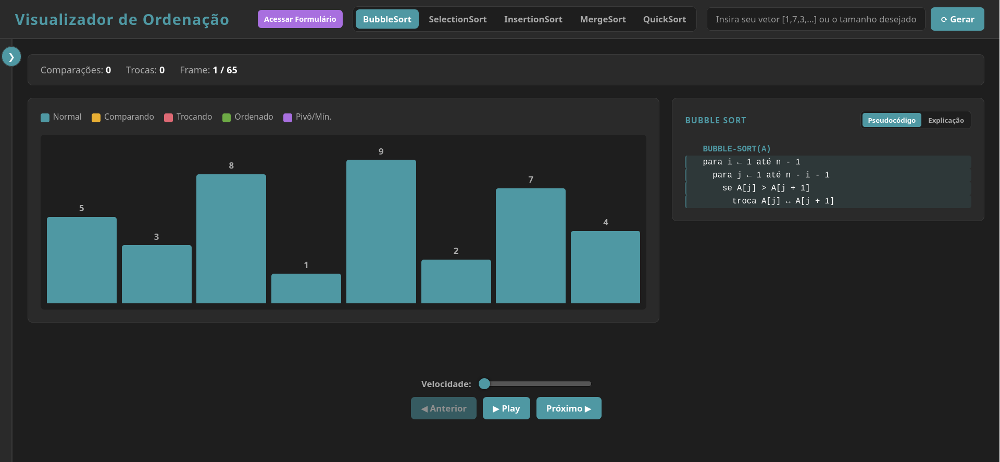

# Visualizador de Algoritmos de Ordenação

Ferramenta educacional que anima a execução de algoritmos de ordenação passo a passo, aplica questões durante a visualização e registra as interações dos alunos para acompanhamento do professor.

Desenvolvido como Trabalho de Conclusão de Curso em Sistemas de Informação na Faculdade Presbiteriana Gammon, sob orientação de Luccas Rafael Martins Pinto.

**[Acessar a ferramenta](https://j0taeme.github.io/visualizador/)**

---

## O que ela faz

- **Cinco algoritmos:** Bubble Sort, Selection Sort, Insertion Sort, Merge Sort e Quick Sort.
- **Navegação bidirecional:** avança e retrocede pela execução passo a passo, sem reiniciar a animação.
- **Pseudocódigo sincronizado:** as linhas correspondentes ao passo atual ficam destacadas, com alternância entre pseudocódigo e explicação em linguagem natural.
- **Estado visual por cor:** distingue elementos sendo comparados, trocados, já ordenados e o pivô.
- **Contadores em tempo real** de comparações e trocas.
- **Vetor personalizável:** o aluno informa o próprio vetor ou apenas o tamanho para geração aleatória.
- **Questões contextuais:** perguntas calculadas a partir do vetor e do passo atual, com opção de pausar a animação até que sejam respondidas.
- **Tutorial guiado** na primeira visita.
- **Painel do professor** com autenticação e exportação dos dados em CSV.

## Tecnologias

JavaScript (ES Modules), HTML, CSS, Supabase (PostgreSQL, Auth e API REST via PostgREST). Sem framework e sem etapa de build.
